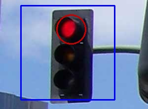

# Traffic Light Detector
Traffic Light recognition and color detection


## Description
See [DESCRIPTION.md](./DESCRIPTION.md)



## Installation

```shell
git clone https://github.com/kristoferssolo/Traffic-Light-Detector
cd Traffic-Light-Detector
pip install .
```

## Examples
`./main.py` -- Creates necessary directories in `/assets/`

`./main.py -i` -- Detects traffic lights and their signal color for all files located in `/assets/images_in/` and saves them in `/assets/images_out/`.

`./main.py -c <int>` -- Uses webcam or any camera to detect traffic lights in real time.

`./main.py -sc <int>` -- Plays sound file located in `/assets/sound/move.mp3` whenever green light signal is detected via camera.

Replace `<int>` with your camera number specified by the operating system. Probably `0` or `1`, but can be higher.

## To Do
- [ ] Write unit tests.
- [ ] Create/find better traffic light model for better traffic light recognition.
